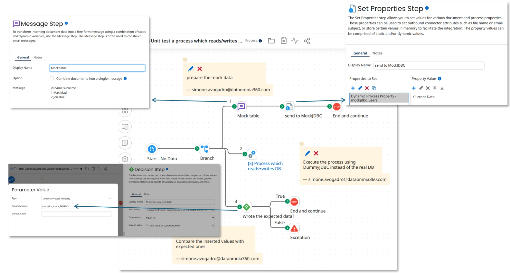

# mockjdbc
[](https://circleci.com/gh/SimoneAvogadro/dummyjdbc)

> **mockjdbc** is the new name of this fork of [dummyjdbc](https://github.com/kaiwinter/dummyjdbc), the original project
> by Kai Winter. The GitHub repository still keeps its old name for now.

**Current version: 2.0.1** – see the [CHANGELOG](CHANGELOG.md).

mockjdbc is a JDBC driver that never talks to a real database. Your code – or your **Boomi process** – runs its SQL as
usual and gets back the data you prepared as CSV, while every INSERT, UPDATE, DELETE and stored procedure call is
recorded, so that a test can check exactly what was written.

## Unit testing Boomi processes



mockjdbc lets you unit test Boomi processes that use a database, without the database:

* **provide the tables** as Dynamic Process Properties, e.g. `mockjdbc_users` = a CSV built with a Message step;
* **run the process under test** unchanged: only for the test, environment or test extensions switch its database
  connection to mockjdbc;
* **check what it wrote**: the parameters of the INSERT/UPDATE/DELETE into `users` are in `mockjdbc_users_PARAMS`.

It works with both the Database (Legacy) and the Database V2 connectors and needs no Boomi-specific setup: the driver
detects the Boomi runtime by itself. Follow the **[step-by-step tutorial](TUTORIAL.md)**, then see
[FEATURES.md, section 11](FEATURES.md#11-running-inside-boomi) for every option (repeated queries, resets, stored
procedures, ...).

## Quick start in Java

```java
MockJdbcDriver.reset();
MockJdbcDriver.addInMemoryTableResource("users",
        "id|integer, name\n" +
        "1, John\n" +
        "2, Mary");

Connection connection = DriverManager.getConnection("any");

ResultSet rs = connection.createStatement().executeQuery("SELECT * FROM users");   // John, Mary

PreparedStatement insert = connection.prepareStatement("INSERT INTO users (id, name) VALUES (?, ?)");
insert.setInt(1, 3);
insert.setString(2, "Anna");
insert.executeUpdate();
assertEquals("3,Anna", MockJdbcDriver.getInMemoryTableResource("users_PARAMS"));
```

## Key features

* **Datasets in memory or on file**: CSV strings, `InputStream`s, files, a `/tables/` folder on the classpath (also inside
  a jar) or a directory per database (`jdbc::mock::<dir>`) – [sections 2, 7, 8](FEATURES.md#2-quick-start-in-memory-dataset).
* **Flexible matching**: by table name, by an explicit `-- TESTCASE:` comment, by stored procedure name, by query
  parameters (`users?Smith`), by execution step, and by repetition (`users#1`, `users#2`) –
  [sections 3–5](FEATURES.md#3-how-a-query-finds-its-dataset).
* **Captured writes**: parameters of INSERT, UPDATE, DELETE and procedure calls, also in batches –
  [section 6](FEATURES.md#6-capturing-statement-parameters).
* **Realistic results**: typed columns (`id|integer`, `price|double`, `day|date`, ...), `getObject`, SQL `NULL`,
  `getColumns` and the other metadata used by tools – [sections 9–10](FEATURES.md#9-csv-format-reference).
* **Boomi support** through Dynamic Process Properties, with no dependency on Boomi – [section 11](FEATURES.md#11-running-inside-boomi).

## Installation

* **Jar**: download it from the [releases](https://github.com/SimoneAvogadro/dummyjdbc/releases), or build it with
  `mvn package` (`target/mockjdbc-<version>.jar`; Java 8 bytecode). The Maven coordinates are
  `me.avogadro.mockjdbc:mockjdbc` (not published on Maven Central: use `mvn install` for a local repository).
* **Runtime dependencies**: `net.sf.opencsv:opencsv` 2.3, `org.aspectj:aspectjrt` 1.9.22.1 and `org.slf4j:slf4j-api`
  (already provided by the Boomi runtime).
* **Driver**: class `me.avogadro.mockjdbc.MockJdbcDriver`, JDBC URL `any` (or `jdbc::mock::<dir>`).

In Boomi, upload the jar and its dependencies to a Custom Library; when you upgrade, stop the Atom, delete the old jars
and restart it ([details](FEATURES.md#installation)).

## Documentation

* [TUTORIAL.md](TUTORIAL.md) – step-by-step Boomi unit test.
* [FEATURES.md](FEATURES.md) – complete guide to every feature.
* [CHANGELOG.md](CHANGELOG.md) – what changed in each version, including the history of dummyjdbc.
* [FUTURE.md](FUTURE.md) – ideas and known issues not addressed yet.

## Credits and license

mockjdbc is based on [dummyjdbc](https://github.com/kaiwinter/dummyjdbc) by Kai Winter and is distributed under the
Apache License 2.0 (see [LICENSE](LICENSE)).
