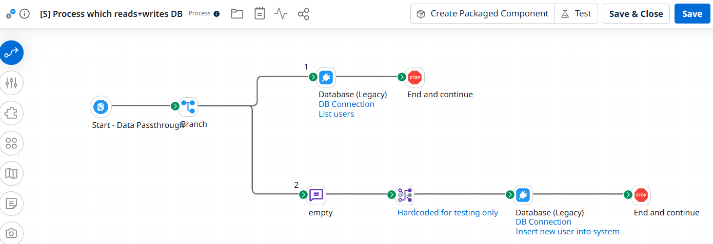
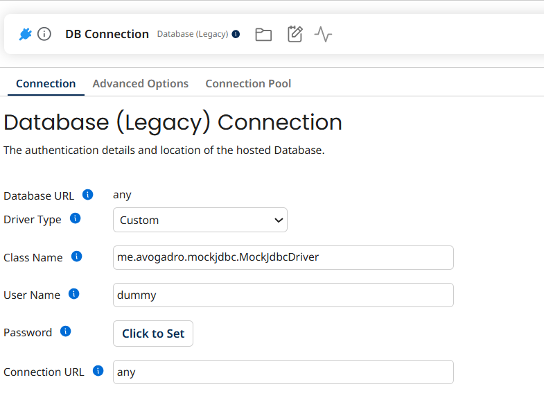
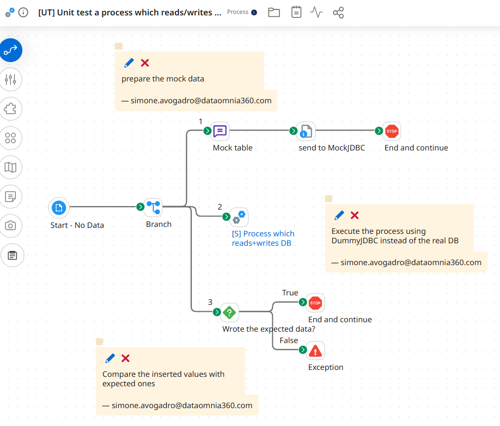
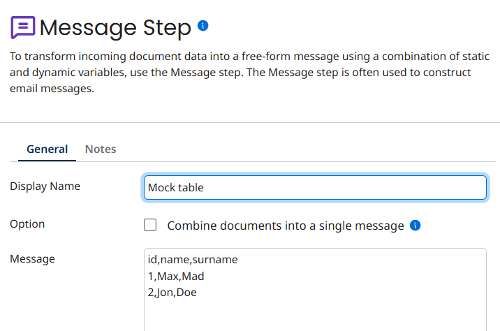
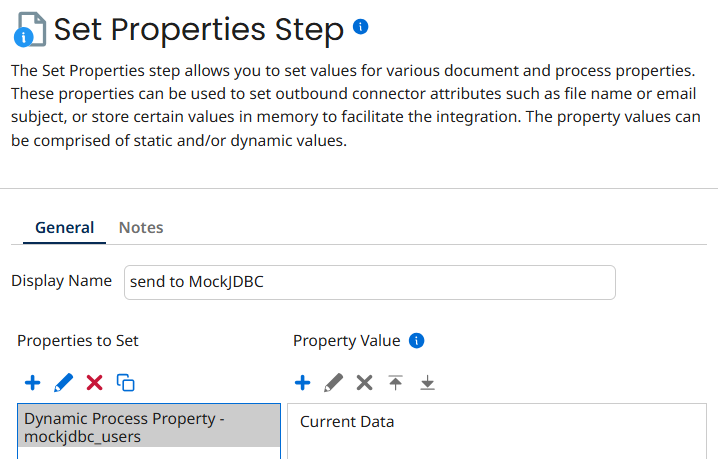
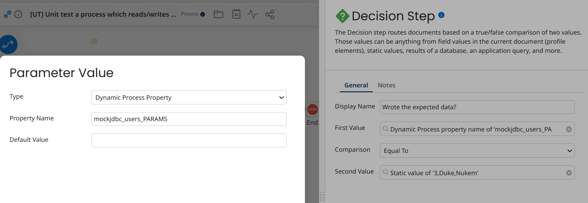

# Tutorial: unit testing a Boomi process with mockjdbc

This step-by-step tutorial builds a Boomi **unit test** for a process that reads and writes a database, without
touching the real database. mockjdbc replaces the database:

* the test **provides the table data** that the process will read;
* the test **checks the parameters** that the process wrote.

The full reference of every feature is in [FEATURES.md](FEATURES.md); this page only follows one example from start to
end.

**Contents**

1. [Before you start](#1-before-you-start)
2. [The process under test](#2-the-process-under-test)
3. [Point the database connection to mockjdbc](#3-point-the-database-connection-to-mockjdbc)
4. [Create the test process](#4-create-the-test-process)
5. [Path 1: prepare the mock table](#5-path-1-prepare-the-mock-table)
6. [Path 2: run the process under test](#6-path-2-run-the-process-under-test)
7. [Path 3: check what was written](#7-path-3-check-what-was-written)
8. [Run the test](#8-run-the-test)
9. [Going further](#9-going-further)

---

## 1. Before you start

Upload to a Custom Library deployed on your runtime (Atom, Molecule, ...):

* the mockjdbc jar (`mockjdbc-<version>.jar`);
* its dependencies `net.sf.opencsv:opencsv` 2.3 and `org.aspectj:aspectjrt` 1.9.22.1 (`slf4j` is already provided by
  the Boomi runtime).

See [FEATURES.md, section 11 – Installation](FEATURES.md#installation) for the details, including the procedure to
follow when you **upgrade** the jar (stop the Atom, delete the old jars, restart).

---

## 2. The process under test

The process we want to test, **"[S] Process which reads+writes DB"**, uses a Database (Legacy) connector twice:



* **Path 1 – "List users"**: a query on the `users` table (`SELECT ... FROM users`).
* **Path 2 – "Insert new user into system"**: a map ("Hardcoded for testing only", which in this example builds the
  user `3`, `Duke`, `Nukem`) followed by an `INSERT INTO users (...) VALUES (?, ?, ?)`.

With mockjdbc behind the connection:

* the query on `users` returns the rows stored in the Dynamic Process Property **`mockjdbc_users`**;
* the parameters of the INSERT into `users` are captured in the Dynamic Process Property **`mockjdbc_users_PARAMS`**,
  as a comma-separated string in parameter order (here `3,Duke,Nukem`).

The process itself does not change: only its database connection does.

---

## 3. Point the database connection to mockjdbc

In the environment where the tests run, configure the **Database (Legacy) Connection** used by the process with the
mockjdbc driver:



| Field | Value |
|-------|-------|
| Driver Type | `Custom` |
| Class Name | `me.avogadro.mockjdbc.MockJdbcDriver` |
| Connection URL | `any` |
| User Name / Password | any value (they are ignored), e.g. `dummy` |

The same driver class and URL work with the Database V2 connector as well.

---

## 4. Create the test process

Create a new process, **"[UT] Unit test a process which reads/writes ..."**:



* **Start** shape: *No Data*.
* A **Branch** shape with **three paths**. Boomi runs the paths of a Branch one after the other, in order, and that
  order matters here:
  1. prepare the mock data;
  2. run the process under test;
  3. compare what it wrote with what we expect.

The next sections configure each path.

---

## 5. Path 1: prepare the mock table

### A Message step with the table

Add a **Message** step, here called **"Mock table"**. Its message is the content of the table, in CSV format:



```csv
id,name,surname
1,Max,Mad
2,Jon,Doe
```

* The first line is the header with the column names, the other lines are the rows.
* Optionally declare column types in the header, e.g. `id|integer,name,surname`, to get numbers instead of text. See
  [FEATURES.md, section 9](FEATURES.md#9-csv-format-reference) for the complete CSV format.

### A Set Properties step to hand it to mockjdbc

Add a **Set Properties** step, here called **"send to MockJDBC"**, which stores the message in a Dynamic Process
Property:



| Property to set | Property value |
|-----------------|----------------|
| Dynamic Process Property **`mockjdbc_users`** | Current Data |

The name is the prefix `mockjdbc_` followed by the table name used in the SQL. **Use lower case**: mockjdbc always reads
the lower case name, whatever case the SQL uses (see
[property names](FEATURES.md#property-names)).

End the path with a **Stop** shape ("End and continue") so that the Branch goes on with path 2.

---

## 6. Path 2: run the process under test

Add a **Process Call** step pointing to **"[S] Process which reads+writes DB"**.

The called process shares the Dynamic Process Properties of the test, so:

* its query on `users` returns the two rows of `mockjdbc_users`;
* its INSERT into `users` sets `mockjdbc_users_PARAMS` (and its lower case copy `mockjdbc_users_params`).

---

## 7. Path 3: check what was written

Add a **Decision** step, here called **"Wrote the expected data?"**:



| Field | Value |
|-------|-------|
| First Value | Dynamic Process Property, Property Name **`mockjdbc_users_PARAMS`** |
| Comparison | Equal To |
| Second Value | Static value **`3,Duke,Nukem`** |

* **True** → a **Stop** shape ("End and continue"): the test passes.
* **False** → an **Exception** shape: the test fails, and the process log shows it.

`mockjdbc_users_PARAMS` holds the parameters of the **last** write into `users`. When the process writes several
times, each write is also kept as `mockjdbc_users_PARAMS#1`, `mockjdbc_users_PARAMS#2`, ... (see
[section 9](#9-going-further)).

---

## 8. Run the test

Run the test process (Test mode or a deployed execution):

* the Decision takes the **True** branch and the execution completes: the process under test read the mock table and
  inserted the expected user;
* to see the test fail, change the expected value of the Decision (e.g. `3,Duke,Nukem2`): the execution ends in the
  Exception shape.

If something does not work:

* **The process reads no rows**: check the property name (`mockjdbc_` + table name, lower case) and that path 1 runs
  before path 2.
* **`mockjdbc_users_PARAMS` is empty**: check that the statement is an INSERT, UPDATE, DELETE or stored procedure call
  on `users` (SELECT parameters are never captured), and that the table name contains only letters (otherwise use a
  `-- TESTCASE:` comment, see [FEATURES.md, section 6](FEATURES.md#6-capturing-statement-parameters)).
* **The driver class is not found, or an old behaviour persists**: make sure the Custom Library contains the current
  jar only (see [Before you start](#1-before-you-start)). At startup the driver writes
  `MockJDBC <version> registered in DriverManager: false` in the container log.

---

## 9. Going further

* **Several scenarios in one test**: number the mock data, e.g. `mockjdbc_users#1` for the first query on `users` and
  `mockjdbc_users#2` for the second one, and read each write as `mockjdbc_users_PARAMS#1`, `#2`, ...
  ([repeated use](FEATURES.md#repeated-use-of-the-same-resource-users1-users2)). Set `mockjdbc#RESET` to start the
  numbering again between scenarios; a new execution always starts from 1
  ([counters across executions](FEATURES.md#counters-across-executions)).
* **The same table queried with different filters**: provide `mockjdbc_users?Smith` for the query with parameter
  `Smith` ([section 4](FEATURES.md#4-different-results-for-different-parameters)).
* **Database V2 operations** (Standard Get/Insert/Update/Delete, Dynamic Insert, ...): define every table the operation
  uses, even with the header only, so that the connector knows its columns
  ([installation notes](FEATURES.md#installation)).
* **Stored procedures**: `EXEC my_proc ?` reads `mockjdbc_my_proc` and captures `mockjdbc_my_proc_PARAMS`.

The editable sources of the pictures of this tutorial are in [`docs/sources`](docs/sources).
